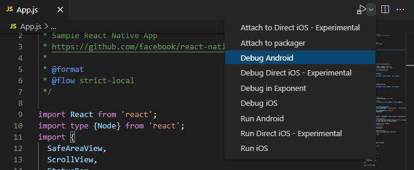

# Run and Debug your React Native application
## Ways to start debug session
This extension supports generating debugging configuration in the `.vscode/launch.json` file by selecting debugging parameters in dropdown lists at the top of the editor.

The extension also allows to start debugging without creating the `launch.json` file in one of the following ways:
- Using dynamic debugging configurations

    
- Using Debug button in the Editor Title area menu

    

## Enable `Debug JS Remotely` and attach to application
After using one of the suggested methods of launching the application, wait for the application to launch.

Once app is loaded and running, [open the developer menu](https://reactnative.dev/docs/debugging#accessing-the-in-app-developer-menu) inside your application and enable remote debugging by clicking on `Debug JS Remotely` button. After that, please wait until the extension attaches to your application.

